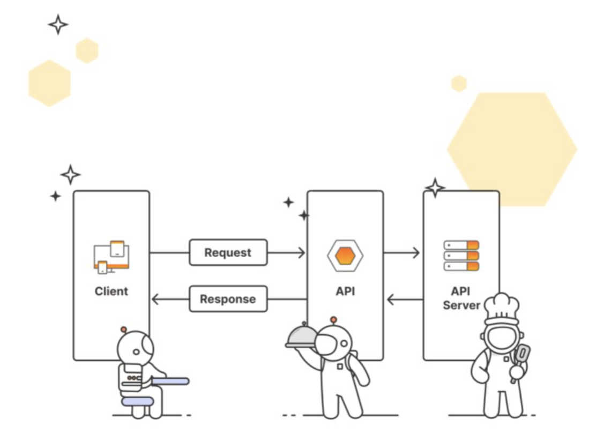

# Application Programming Interfaces

An Application Programming Interface (API) is a contract that allows code to talk to other code.

## Why are APIs important?

1. APIs help developers integrate exciting features and build automation without reinventing the wheel  
Ex: using a Weather API instead of launching your weather balloons.
2. APIs allow enterprises to open up their product for faster innovation  
Ex: apps that interact with Twitter or Meta APIs by posting on your behalf or reading tweets.
3. APIs can be products themselves  
Ex: Software as a Service (SaaS) products like Stripe's payment APIs or Twilio's text messaging and email APIs.

## APIs - A Digital Restaurant




## Types of APIs

* **Hardware APIs**  
Interface for software to talk to hardware.  
Example: How your phone's camera talks to the operating system. 
* **Software Library APIs**  
Interface for directly consuming code from another code base.  
Example: Using methods from a library you import into your application.
* **Web APIs**  
Interface for communicating across code bases over a network.  
Example: Fetching current stock prices from a finance API over the internet.

## API Architectures
* REST (Representational State Transfer)
* GraphQL
* WebSockets
* Webhooks
* SOAP (Simple Object Access Protocol)
* gRPC (Google Remote Procedure Call)
* MQTT (MQ Telemetry Transport)

This course focuses on REST APIs since this is the most widely adopted API architecture.  

You can read more about types of APIs on the [Postman Blog](./assets/A%20guide%20to%20the%20different%20types%20of%20APIs%20_%20Postman%20Blog.pdf).

### REST APIs
Some traits of REST APIs include not storing session state between requests, the ability to cache, and the ability to send and receive various data types.

## Who can access the APIs

* **Public APIs (aka Open APIs)**  
Consumed by anyone who discovers the API

* **Private APIs**  
Consumed only within an organization and not made public

* **Partner APIs**  
Consumed between one or more organizations that have an established relationship

The API we will use in this course will be a **Public, REST, Web API** 👀.

#  An API Platform 
Postman is an API platform for building and using APIs. Postman simplifies each step of the API lifecycle and streamlines collaboration so you can create better APIs faster and consume them with ease.

## Working with APIs then and now: cURL vs. Postman

Before Postman, it was common practice to poke at APIs with a command line tool for making HTTP requests called cURL. This tool is still used today but has its limitations when it comes to collaboration and sharing.

#### API calls with curl
```shell
curl https://api.github.com/users/postmanlabs
```
This is an example of what an API call in the terminal using the curl command looks like. Here we are fetching data about GitHub user postmanlabs.


It works great, but once you make the call, the API response data is lost in the river of the terminal.

#### API calls with Postman
Postman shows the response with clean indents and colors and allows you to save, organize and share your requests. You can also see all the components of the request and response broken down into tabs and other helpful details like the response time and status code. 


# Getting Started with Postman (Installation-Set up)

# My First API Request

###  Task: Create a workspace 
1. Workspaces dropdown > Create Workspace
Create Workspace
2. Select Blank Workspace as Template 
3. Name your workspace "Postman API Fundamentals Student Expert" and set the visibility to Only me - Personal. Then click "Create Workspace."

###  Task: Create a collection 
1. From the left pane, either click the plus ("+") icon or Create a collection.
2. Select Blank collection
3. Name your new Collection “Postman Library API v2”

###  Task: Get books from the Library API 
1. Create a new request by either clicking Add a request inside your new Collection or hovering on your Collection, then click the three dots icon and "Add request"  
2. Name your request "get books". Set the request method to GET, and the request URL to GET https://library-api.postmanlabs.com/books  

Be sure to hit Save your work using Ctrl Key

3. Send your request by clicking the Send button

## Request methods
When we make an HTTP call to a server, we specify a request method that indicates the type of operation we are about to perform. These are also called HTTP verbs.


Refer to the API Documentation here: [Postman Library API v2 docs](./assets/Postman%20Library%20API%20v2%20docs.pdf)

## Request URL
In addition to a request method, a request must include a request URL that indicates where to make the API call. A request URL has three parts: a protocol (such as http:// or https://), host (location of the server), and path (route on the server). In REST APIs, the path often points to a reference entity, like "books".  
Paths and complete URLs are also sometimes called API endpoints.


## Response status codes
The Postman Library API v2 has returned a response status code of "200 OK". Status codes are indicators of whether a request failed or succeeded.  

Status codes have conventions. For example, any status code starting with a "2xx" (a "200-level response") represents a successful call. Get familiar with other status code categories:


##  Request-Response pattern 
An API is the interface that lets us know what kind of response to expect when we make certain calls to a server. 


The client is the agent making a request. A client could be a browser or an application you have coded, for example. In our case Postman is the client because that's how we sent the request.  

The request is sent over a network to some server. In our case, we made a request over the public internet to a server located at the address https://library-api.postmanlabs.com.  

The server interpreted the request (GET /books) and sent the appropriate response over the network back to the Postman client: a list of books.

# Request Parameters

## Variables in Postman 
We will use a variable to replace our base URL so that we don't have to type that repeatedly. Once a variable is defined, you can access its value using double curly brace syntax like this: {{variableName}}

#### **Set the "baseUrl" variable**
1. Go to the "get books" request in your collection.
2. With your cursor, select the entire base URL of the API (https://library-api.postmanlabs.com). Do not include the slash / after .com.  

Click "Set as variable" to save the base URL to a variable.
3.  Click "Set as a new variable".
4. Name your new variable "baseUrl" and select "Collection" as the scope, then click Set variable.  

Note that the variable is set, you can access the value anywhere in your collection by typing **{{baseUrl}}**, it will work exactly like before!

##  Query parameters
Tthe minimum ingredients you need to make a request are:
* a request method (GET/POST/PUT/PATCH/DELETE, etc)
* a request URL  

Some APIs allow you to refine your request further with key-value pairs called **query parameters**.  

Query parameters are added to the end of the path. They start with a question mark ?, followed by the key-value pairs in the format: <key>=<value>.  
If there are multiple query parameters, each is separated by an ampersand &.

```
GET https://some-api.com/photos?orientation=landscape&size=500x400
```

### When to use query parameters?

Sometimes, query parameters are optional and allow you to add filters or extra data to your responses. Sometimes, they are required in order for the server to process your request. APIs are implemented differently to fulfill different needs. 

## Task: Search books by genre
Let's filter the library catalog to get all the fiction books.  

1. In Postman, inside the  Postman Library API v2 Collection you made, hover over the "get books" request, click the three dots icon that appears, and then select Duplicate to create a copy of the request.
2. Rename this second request from the default "get books Copy" to "get fiction books."
3.  Using the Params tab, add a query parameter with a key genre and value fiction to the "get fiction books" request.  
Notice how Postman syncs the request URL in real time, adding the question mark ? automatically to mark the start of query parameters!
4. Save and Send your request.  

You should get a 200 OK response with an array of book objects - but only books with the fiction genre!


##  Task: Multiple query parameters 
Let's add a second query parameter to GET /books only to list books where the checkedOut property is false.

1. In the same "get fiction books" request, in the Params tab, add a second query parameter with a **key: checkedOut** and **value: false**.
2. Save and Send your request.  

You should get a 200 OK response with an array of only fiction books that are not checked out or an empty array [] if there are no fiction books available.


##  Path Variable
A **path variable** (a.k.a. "path parameters") is a dynamic section of a path and is often used for IDs and entity names such as usernames.  

```
GET https://api.github.com/users/{username}
```

Making this API call with a value for {username} will fetch data about that user:

Example:
```
GET https://api.github.com/users/postmanlabs
```

You can have multiple path variables in a single request, such as this endpoint for getting a user's GitHub code repository:

```
GET https://api.github.com/repos/{owner}/{repoName}
```

For example, to get information about the newman code repository from postmanlabs:

```
GET https://api.github.com/repos/postmanlabs/newman
```

### Path vs. query parameters


##  Task: Get a book by id
If a person keeps asking about the book "Ficciones" by Jorge Luis Borges, you've jotted down that the unique id of this book is **29cd820f-82f9-4b45-a7f4-0924111b5b89**.  

Verify the id of this book with search query parameter:
```
GET /books?search=ficciones
```

We can get a specific book by hitting the path GET /books/:id, where we replace :id with the book's id.

1. Hover on your Postman Library API v2 Collection, click the three dots icon and select Add request. Name your new request "get book by id".
2. Make sure the request method is set to GET, and paste in this endpoint as the request URL: **{{baseUrl}}/books/:id**
3. In the Params tab of the request, paste the id for "Ficciones" (29cd820f-82f9-4b45-a7f4-0924111b5b89) as the value for the path variable named id. Make sure not to add any whitespace around the id value.
4. Save and Send your request. You should get a 200 OK response with a single JSON object that represents the "Ficciones" book.


### Debugging requests in the Postman Console

You used Postman's path variable helper in the Params tab of the request to add a path variable nicknamed :id to the request URL in a human-friendly way. Postman replaces :id with the value you specify for id in the Path Variables editor.  

You can always view the raw request sent to the API by opening the Postman Console in the lower left of Postman.


# Sending data with POST

##  Task: Add a book 
We will learn how to add a book via POST request with a JSON Body to submit book data to our Postman Library API database. The endpoint for adding a book is documented [here](https://documenter.getpostman.com/view/15567703/UVyxRtng#e0dbc14c-371d-4813-97c3-281de36fad0c).  

The Body tab in Postman enables you to specify the data you need to send with a request. You can send different types of body data to suit your API.  
You can use raw body data to send anything you can enter as text. Use the raw tab, and the type dropdown list to indicate the format of your data (Text, JavaScript, JSON, HTML, or XML), and Postman will enable syntax-highlighting and appending the relevant headers to your request.

### Make a POST request
1.  Hover over your Postman Library API v2 Collection, click the three dots icon and select Add request. Name your new request "add book"
2.  Set the request method to **POST** and the request URL to **{{baseUrl}}/books**
3. This endpoint requires adding a body to our request to send a payload. Our payload will be a JSON object containing the information about the book we are adding.

Click the Body tab of the request and select that data type raw > JSON
4. Think of a book you love or have read recently.  

You can copy this object and replace the values with details about your book!
```json
{
  "title": "Dharmayoddha Kalki: Avatar of Vishnu",
  "author": "Kevin Missal",
  "genre": "mythological fiction",
  "yearPublished": 2018
}
```
5.  Save and Send your request.  


😱 Uh-oh!  
The response from the server came back with a status **401 Unauthorized**. Remember that 400-level errors are **client errors**, meaning we made a mistake in our request.  

The body of the response has a message explaining we need to add an api-key to the headers of the request. Let's fix this error.

## Task: Add an authorization header
Some APIs require Authorization (aka Auth) for certain endpoints in order to permit a request.

There are multiple methods for authorizing a request. Some examples are Basic Auth (username and password), OAuth (delegated authorization), and API Keys (secret strings registered to a developer from an API portal). 

#### Getting an API Key
The API Key allows the API to track who is making calls and how often.  
The Postman Library API v2 uses very light protection and does not require you to register for an API Key. You simply have to know it:

Header name: **api-key**
Header value: **postmanrulz**

#### Headers
Headers are how we can add metadata about our requests, such as authorization information or specify the data type we want to receive in a response. This is different than the actual payload data we send in the body of a request, such as our new book information.

### Add the API Key to the request header
1. On your "add a book" request, click the Headers tab.
2. In the Headers helper table, add the **key: api-key** with a **value: postmanrulz**
3. Save and Send your request. 

🚀 Success!  
Your book was added! Now that your request is properly authorized in the header, you should get a 201 Created response with a response body that is an object representing your newly added book!


You can now return to your "get books by id" request, and in the path parameter id replace it with the value of the id you received in the body of the book you added.

There is an easier way to add Auth in Postman... let's find out next 👀

## Task: Use Postman Auth instead!

1. In the **add book** request hover over the api-key header in the Headers tab and click the "x" icon at the right to delete the header. Save your request.
2. Click on your collection "Postman Library API v2" and select the **Authorization** (or Auth) tab
3. Select **API Key** as the auth Type
4. Enter the API Key details in the fields below. Key: api-key, Value: postmanrulz, Add to: Header
5. Save the changes to your collection by clicking the floppy disk icon in the upper right (important!)


#### Add a new book
1. Go back to your "add a book" request and add another book by changing the body in the Body tab
2. Ensure the Auth method in the Authorization tab of your request is set to "Inherit from parent" to use the API Key we set at the collection level. This is the default behavior for requests.
3. Save your request and hit Send!
4. Open up the Postman Console in the lower left, and you'll see that the API Key has been added as a header api-key: postmanrulz, which is why we were authorized to add a book!


# Introduction to variables and scripting

## Variables in Postman (Continued)
Postman allows you to save values as variables so that you can:  
1. Reuse values to keep your work DRY (Don’t Repeat Yourself)
2. Hide sensitive values like API keys from being shared publicly

### Variable scopes
From broadest to narrowest, these scopes are global, collection, environment, data, and local.


The preference of the local variable is more than the global variable.  
In this course we will deal with the collection variables, which live at the collection level and can be accessed anywhere inside the collection.

##  Setting variables programmatically 

### Scripting in Postman
Postman allows you to add automation and dynamic behaviors to your collections with scripting.  

Postman will automatically execute any provided scripts during two events in the request flow:
1. Immediately before a request is sent: **pre-request script** (Pre-request Script of Scripts tab).
2. Immediately after a response comes back: **post-response script** (Post-response of Scripts tab).

In this lesson, we will focus on writing scripts in the Post-response tab, which are executed when a response comes back from an API.

### The pm object
Postman has a helper object named pm that gives you access to data about your Postman environment, requests, responses, variables and testing utilities. 

For example, you can access the JSON response body from an API with: **pm.response.json()**

You can also programmatically get collection variables like the value of baseUrl with: **pm.collectionVariables.get(“baseUrl”)**

In addition to getting variables, you can also set them with pm.collectionVariables.set("variableName", "variableValue") like this: **pm.collectionVariables.set(“myVar”, “foo”)**

## Add a script to your request
1. In your "add a book" request, change the book data in your Body to a new book you like.

2. From the Scripts tab of your request, open the Post-res tab (short for Post-response)

3. Inside the Script editor, add this JavaScript code to log the JSON response from the API:
```js
console.log(pm.response.json())
```


4. Save your request
5. Send your request. This will trigger the script in the Post-response script tab to run after the response comes back from the API
6. Open the Postman Console in the lower left of the window.
7. Scroll to the bottom of the logs in the console. You will see your most recent request POST https://library-api.poistmanlabs.com/books


##  Task: Grab the new book id 
1. In the Body tab of the "add a book" request, change the book's details to add a new book!
2. In the Post-response tab in Scripts of the "add a book" request, replace the console.log() statement with this code:
```js
// save the "id" value from the response to a variable named "id"
const id = pm.response.json().id
// save the id as a collection variable named "id"
pm.collectionVariables.set("id", id)
```


3. Save and send your request.  
When the 201 the response comes back from the API with your newly created book, and the test script will run and save the book's id as a collection variable automatically.

4. View your collection variables by clicking on your Postman Library API v2 collection, then the Variables tab.  
The id variable has been automatically assigned the id of your new book as its Current Value!


You can now use **{{id}}** anywhere in your collection to access this value!

## Test your collection locally

1. Fork the test collection into your workspace by clicking this link and following the guide below.  

While hovering on the "Collection Test" collection from the link above, click on the three dots, then Create a fork.  

On the next screen, choose your workspace ("Postman API Fundamentals Student Expert") as the destination workspace to send your forked collection, then click Fork collection.

2. Get the API link for your entire Postman Library API v2 collection:  

Click View more actions on your collection  > Share > Via API > Generate New Key > Copy

3.  Navigate to your forked "Collection Test" collection, open the "Variables" tab, and paste the link in your clipboard copied in the previous step into the collection variable named "submission".

4. Save the Collection 💾
5. Send the Halfway Test  request 📩
6. Check the Test Results tab in the response. If you followed the course properly and passed all the Tests, you should see Test Results (16/16) 


# PATCH and DELETE

## Task: Checkout your book
1. Hover on your Postman Library API v2 collection, click the three dots, and select Add request. Name your new request "checkout a book"
2. Set the request method to PATCH
3. Set the request URL to {{baseUrl}}/books/:id
4. Set the value of the path variable id to {{id}}


5. Add a raw JSON body in the Body tab to update the checkedOut property to true: 
```json
{ 
  "checkedOut": true 
}
```
6. Save and Send your request.  

You should get a 200 OK response that shows the updated data about your book. Notice how checkedOut is now true


##  Task: Delete your book 
1. Hover on your Postman Library API v2 collection, click the three dots, and select "Add request", name your new request "delete a book"
2. Set the request method of the "delete a book" request to DELETE
3. Set the request URL to {{baseUrl}}/books/:id
4. In the Params tab of the request, make sure the path variable id is set to {{id}}
5. Save and Send your request.  

You should get a 204 No Content response from the API. This means the server successfully deleted the book, and won't send any response body back.


Try sending your request again. Since you are sending a request to delete a book with an id that no longer exists, you get a 404 error! 

#  Postman's codegen feature 

## Generating code snippets

Every request you made has a code generation tab you can access from the code </> icon in the far right.  

Once the code snippet generator pane is open, you can select from a dropdown to generate the API request in common coding languages like Python, JavaScript, C, NodeJS and more.  

For example, we can generate the GET /books request in cURL syntax:

```cURL
curl --location 'https://library-api.postmanlabs.com/books/e9211cf1-1ebb-4aa5-8fb7-70a3b47ca4ca' \
--header 'api-key: postmanrulz'
```

If we copy this snippet into the terminal and press Enter, we make the API call and the response body is printed:


#  Submit your Postman collection 
1. Click on the submit request in your "Collection Test" collection.
2.  Ensure that the request method is set to POST, and the request URL to https://lesson-completion.postmanlabs.com/submit
3.  Add a raw JSON body to your request from the Body tab.  

Copy this custom body for you and paste it into the body editor:
```json
{
  "email": "darshansvuvce2226@gmail.com",
  "postmanCollectionJsonUrl": "{{submission}}",
  "publishedCourseId": "2q2jokzsn62y8",
  "lessonId": "go6mgkytvk8u"
}
```
4. Save and Send your submit request 💾.


If your collection passes all the tests, you will get a success message, and this lesson will be marked complete automatically 🎉